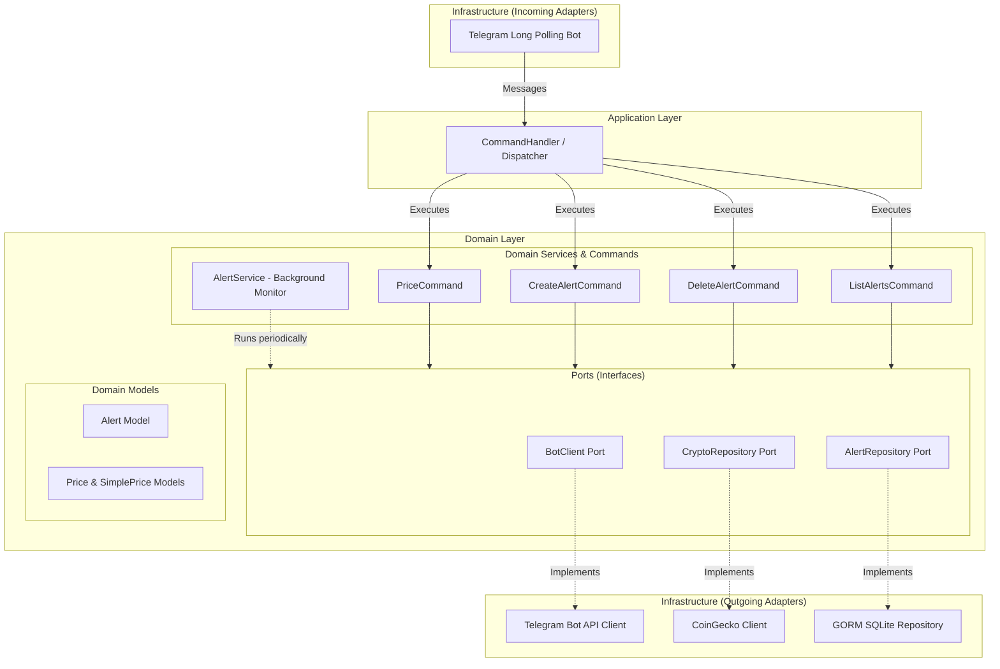
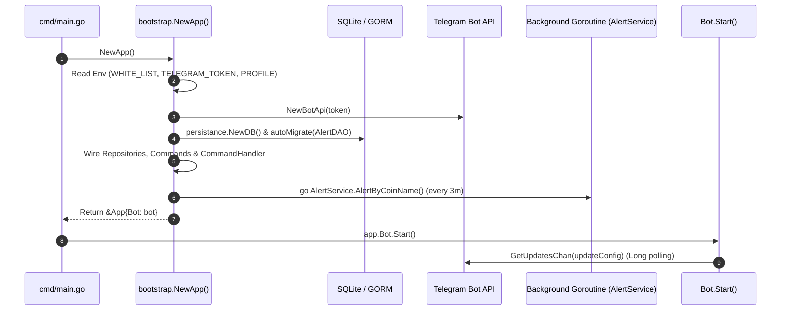
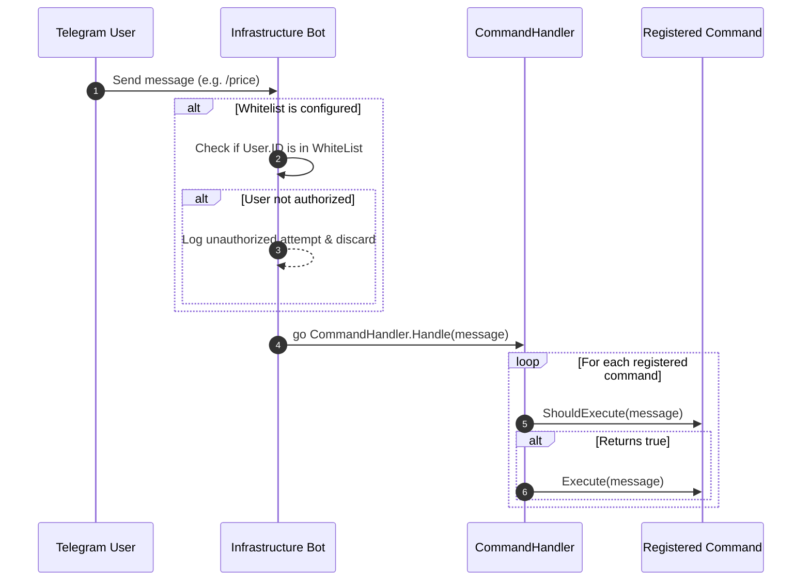
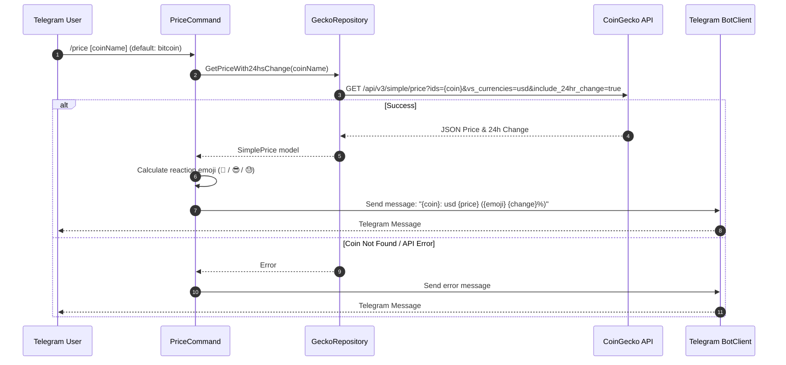
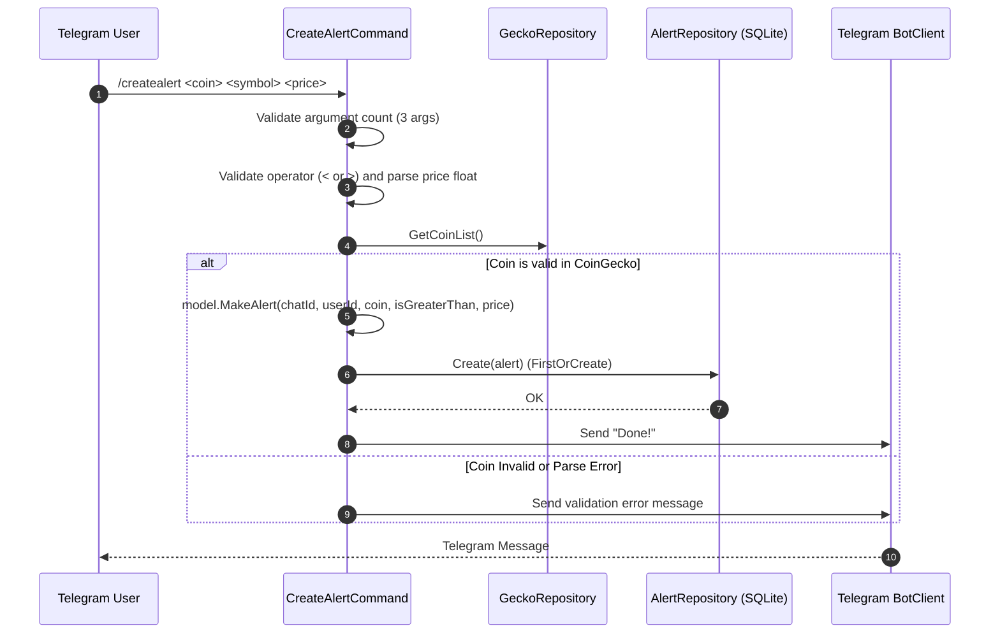
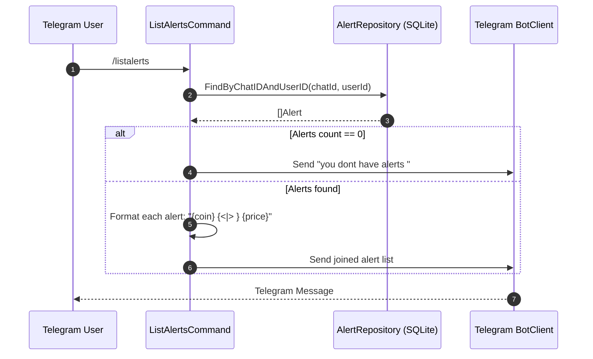
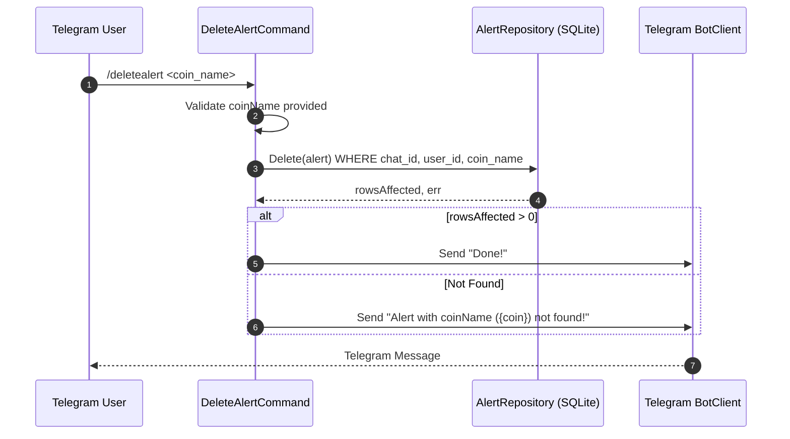
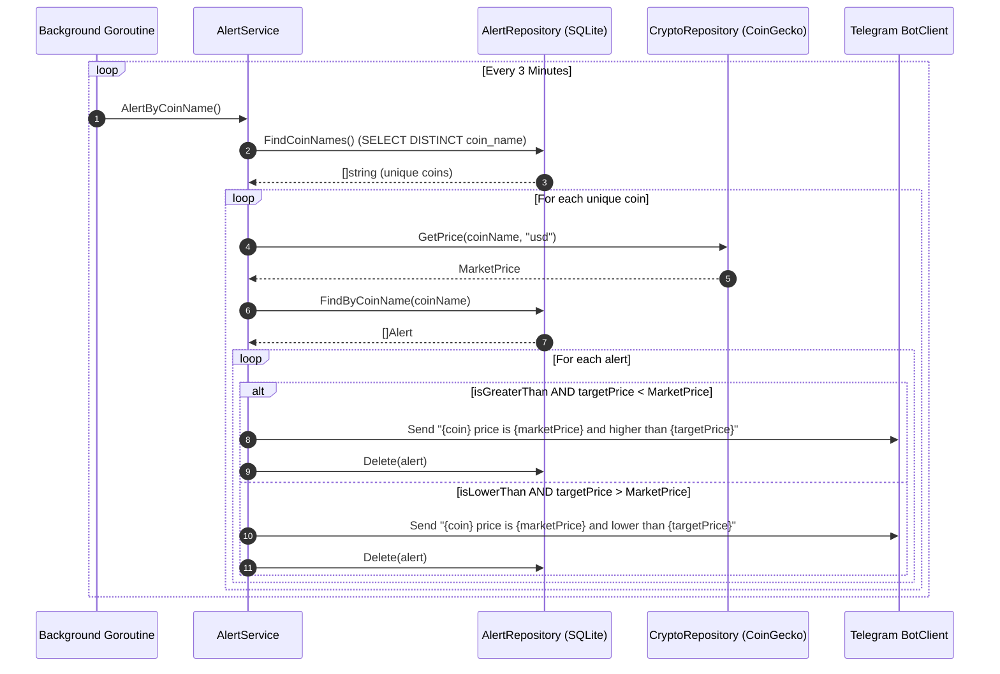

# Crypto Record Bot 🤖📈

A Go-based Telegram bot designed to monitor cryptocurrency prices and set automated price threshold alerts using the CoinGecko API and SQLite storage.

---

## 📑 Table of Contents

- [Overview](#-overview)
- [Architecture & Design Patterns](#-architecture--design-patterns)
  - [Project Structure](#project-structure)
  - [Architectural Layers](#architectural-layers)
- [Third-Party Libraries & Dependencies](#-third-party-libraries--dependencies)
- [Detailed System Flows](#-detailed-system-flows)
  - [1. Application Bootstrapping & Lifecycle](#1-application-bootstrapping--lifecycle)
  - [2. Telegram Update & Whitelist Dispatch Flow](#2-telegram-update--whitelist-dispatch-flow)
  - [3. Price Query Flow (`/price`)](#3-price-query-flow-price)
  - [4. Alert Creation Flow (`/createalert`)](#4-alert-creation-flow-createalert)
  - [5. Alert Listing Flow (`/listalerts`)](#5-alert-listing-flow-listalerts)
  - [6. Alert Deletion Flow (`/deletealert`)](#6-alert-deletion-flow-deletealert)
  - [7. Background Alert Monitor & Trigger Flow](#7-background-alert-monitor--trigger-flow)
- [Database Schema](#-database-schema)
- [Configuration & Environment Variables](#-configuration--environment-variables)
- [Installation & Getting Started](#-installation--getting-started)
- [Bot Commands Reference](#-bot-commands-reference)
- [Technical Insights & Future Enhancements](#-technical-insights--future-enhancements)

---

## 🔍 Overview

**Crypto Record Bot** connects to Telegram via long-polling to provide users with cryptocurrency market data. It allows users to:
- Check real-time cryptocurrency prices with 24-hour percentage changes and contextual reaction emojis (🚀, 😎, 😓).
- Set customizable threshold alerts (trigger when price is greater `>` or lower `<` than a specified value).
- Receive automated Telegram push notifications in background cycles when price conditions are satisfied.
- List and delete active price alerts.
- Restrict bot access using an optional user whitelist.

---

## 🏛 Architecture & Design Patterns

The project is structured following **Hexagonal Architecture (Ports and Adapters)** along with principles from **Domain-Driven Design (DDD)** and the **Strategy Pattern**.



### Project Structure

```text
CryptoRecordBot/
├── cmd/
│   └── main.go                                  # Main application entry point
├── internal/
│   ├── application/
│   │   └── command_handler.go                   # Command dispatcher (Application layer)
│   ├── bootstrap/
│   │   └── wire.go                              # Dependency injection & service initialization
│   ├── domain/
│   │   ├── model/
│   │   │   ├── alert.go                         # Alert domain entity & formatting
│   │   │   └── price.go                         # Price value objects & reaction symbols
│   │   ├── ports/
│   │   │   ├── clients.go                       # BotClient interface definition
│   │   │   └── repositories.go                  # CryptoRepository & AlertRepository interfaces
│   │   └── service/
│   │       ├── alert_service.go                 # Background price evaluator & notifier
│   │       └── commands.go                      # Command interface & command implementations
│   └── infrastructure/
│       ├── bot.go                               # Telegram bot long-polling & whitelist adapter
│       ├── client/
│       │   └── crypto_repository.go             # CoinGecko API adapter implementation
│       └── persistance/
│           ├── database.go                      # GORM SQLite connection & auto-migration
│           ├── entities.go                      # AlertDAO database entity
│           └── repositories.go                  # GORM Alert repository implementation
├── go.mod
├── go.sum
└── README.md
```

### Architectural Layers

1. **Domain Layer (`internal/domain/`)**:
   - **Models**: Defines pure business entities ([`Alert`](file:///C:/Users/emipo/go/crypto-record-bot/internal/domain/model/alert.go#L10), [`PriceWithChange`](file:///C:/Users/emipo/go/crypto-record-bot/internal/domain/model/price.go#L3), [`SimplePrice`](file:///C:/Users/emipo/go/crypto-record-bot/internal/domain/model/price.go#L21)) without external dependencies.
   - **Ports**: Interface contracts ([`BotClient`](file:///C:/Users/emipo/go/crypto-record-bot/internal/domain/ports/clients.go#L5), [`CryptoRepository`](file:///C:/Users/emipo/go/crypto-record-bot/internal/domain/ports/repositories.go#L8), [`AlertRepository`](file:///C:/Users/emipo/go/crypto-record-bot/internal/domain/ports/repositories.go#L14)) decoupling domain logic from specific third-party libraries.
   - **Domain Services & Commands**: Encapsulates command behaviors implementing the [`Command`](file:///C:/Users/emipo/go/crypto-record-bot/internal/domain/service/commands.go#L12) interface (`ShouldExecute`, `Execute`) and the periodic [`AlertService`](file:///C:/Users/emipo/go/crypto-record-bot/internal/domain/service/alert_service.go#L11).

2. **Application Layer (`internal/application/`)**:
   - Contains [`CommandHandler`](file:///C:/Users/emipo/go/crypto-record-bot/internal/application/command_handler.go#L8), which coordinates and routes incoming Telegram messages to the appropriate domain command using the Strategy pattern.

3. **Infrastructure Layer (`internal/infrastructure/`)**:
   - **Telegram Adapter ([`Bot`](file:///C:/Users/emipo/go/crypto-record-bot/internal/infrastructure/bot.go#L9))**: Listens for updates using long-polling, handles whitelist filtering, and spawns concurrent goroutines per message.
   - **Crypto Client ([`GeckoRepository`](file:///C:/Users/emipo/go/crypto-record-bot/internal/infrastructure/client/crypto_repository.go#L12))**: Implements [`CryptoRepository`](file:///C:/Users/emipo/go/crypto-record-bot/internal/domain/ports/repositories.go#L8) interacting with CoinGecko REST endpoints.
   - **Persistence ([`AlertRepository`](file:///C:/Users/emipo/go/crypto-record-bot/internal/infrastructure/persistance/repositories.go#L9))**: Implements [`AlertRepository`](file:///C:/Users/emipo/go/crypto-record-bot/internal/domain/ports/repositories.go#L14) using GORM and SQLite.

4. **Bootstrap & Wire (`internal/bootstrap/`)**:
   - Acts as the composition root ([`wire.go`](file:///C:/Users/emipo/go/crypto-record-bot/internal/bootstrap/wire.go#L26)). Reads environment variables, instantiates concrete implementations, injects dependencies into ports, and launches background routines.

---

## 📦 Third-Party Libraries & Dependencies

| Library | Version | Purpose | Usage in Project |
| :--- | :--- | :--- | :--- |
| [`github.com/go-telegram-bot-api/telegram-bot-api/v5`](https://github.com/go-telegram-bot-api/telegram-bot-api) | `v5.5.1` | Telegram Bot API client | Long-polling updates stream, sending response messages, chat and user ID extraction. |
| [`github.com/superoo7/go-gecko/v3`](https://github.com/superoo7/go-gecko) | `v1.0.0` / `v3` | CoinGecko API client | Fetching token listings, simple single prices, and 24h market price changes. |
| [`gorm.io/gorm`](https://gorm.io/) | `v1.31.2` | Golang ORM | Object-relational mapping, database migrations, CRUD query building. |
| [`gorm.io/driver/sqlite`](https://github.com/go-gorm/sqlite) | `v1.6.0` | SQLite driver for GORM | Embedded SQL database engine support (`crypto_record.db`). |
| [`github.com/mattn/go-sqlite3`](https://github.com/mattn/go-sqlite3) | `v1.14.50` | CGO SQLite3 driver | Low-level SQLite C bindings for Go. |

---

## 🔄 Detailed System Flows

### 1. Application Bootstrapping & Lifecycle



1. [`main.go`](file:///C:/Users/emipo/go/crypto-record-bot/cmd/main.go#L7) invokes [`bootstrap.NewApp()`](file:///C:/Users/emipo/go/crypto-record-bot/internal/bootstrap/wire.go#L26).
2. Reads environment variables:
   - `TELEGRAM_TOKEN` (required).
   - `WHITE_LIST` (optional comma-delimited string parsed into `[]int64`).
   - `PROFILE` (enables debug logging when set to `"dev"`).
3. Connects to SQLite database `crypto_record.db` and runs `autoMigrate` for [`AlertDAO`](file:///C:/Users/emipo/go/crypto-record-bot/internal/infrastructure/persistance/entities.go#L7).
4. Creates CoinGecko HTTP client with a 10-second timeout.
5. Instantiates domain commands and registers them within [`CommandHandler`](file:///C:/Users/emipo/go/crypto-record-bot/internal/application/command_handler.go#L8).
6. Spawns an asynchronous background ticker routine executing [`AlertService.AlertByCoinName()`](file:///C:/Users/emipo/go/crypto-record-bot/internal/domain/service/alert_service.go#L25) every 3 minutes.
7. Calls [`Bot.Start()`](file:///C:/Users/emipo/go/crypto-record-bot/internal/infrastructure/bot.go#L23) to initiate Telegram long-polling (timeout = 60 seconds).

---

### 2. Telegram Update & Whitelist Dispatch Flow



1. An update is received over the updates channel.
2. **Whitelist Evaluation**:
   - **If `WHITE_LIST` is configured**: The bot verifies if `update.Message.From.ID` is present in the allowed list. If unauthorized, access is denied, logged on the server, and the message is discarded.
   - **If `WHITE_LIST` is empty or unset**: Whitelist filtering is bypassed (`len(bot.whiteList) == 0`). The bot operates in **public mode**, allowing any Telegram user to interact and execute commands.
3. If authorized (or running in public mode), the message is dispatched concurrently in a goroutine (`go bot.commandHandler.Handle(*update.Message)`).
4. [`CommandHandler`](file:///C:/Users/emipo/go/crypto-record-bot/internal/application/command_handler.go#L21) tests each command via `ShouldExecute(message)` and runs `Execute(message)` on matches.

---

### 3. Price Query Flow (`/price`)



- **Command Syntax**: `/price` or `/price <coin_id>` (e.g., `/price ethereum`).
- **Default Coin**: Defaults to `"bitcoin"` if no argument is supplied.
- **Emoji Calculation**:
  - `change >= 15%` ➔ 🚀
  - `change > 0%` ➔ 😎
  - `change < 0%` ➔ 😓
  - `change == 0%` ➔ *(empty)*

---

### 4. Alert Creation Flow (`/createalert`)



- **Command Syntax**: `/createalert <coin_name> <comparison_operator> <target_price>`
- **Validation Steps**:
  1. Ensures exactly 3 arguments are provided.
  2. Ensures comparison symbol is `<` or `>`.
  3. Ensures price is a valid decimal number.
  4. Validates `coinName` against CoinGecko's master coin list (`GetCoinList()`).
- **Storage**: Persisted into SQLite via GORM `FirstOrCreate`.

---

### 5. Alert Listing Flow (`/listalerts`)



- **Command Syntax**: `/listalerts`
- Filters records matching the active `ChatID` and `UserID`.
- Formats each alert into a readable string (e.g., `bitcoin > 45000`).

---

### 6. Alert Deletion Flow (`/deletealert`)



- **Command Syntax**: `/deletealert <coin_name>` (e.g., `/deletealert bitcoin`).
- Deletes alerts corresponding to the user and specified coin name.

---

### 7. Background Alert Monitor & Trigger Flow



1. **Cycle Interval**: Executes every 3 minutes.
2. **Distinct Coins Query**: Calls `FindCoinNames()` to retrieve unique coin names with active alerts, minimizing CoinGecko API calls.
3. **Price Query**: Fetches the current USD market price for each distinct coin.
4. **Condition Evaluation**:
   - **Upper bound triggered**: `alert.IsGreaterThan && alert.Price < currentMarketPrice`
   - **Lower bound triggered**: `!alert.IsGreaterThan && alert.Price > currentMarketPrice`
5. **Notification & Cleanup**: Sends a Telegram push notification to the respective `ChatId` and removes the triggered alert from the database.

---

## 🗄 Database Schema

The bot utilizes SQLite with GORM auto-migrations. Table name: `alerts`.

| Column | Type | GORM Constraints | Description |
| :--- | :--- | :--- | :--- |
| `chat_id` | `INTEGER` / `BIGINT` | `primaryKey;autoIncrement:false` | Telegram chat identifier |
| `user_id` | `INTEGER` / `BIGINT` | `primaryKey;autoIncrement:false` | Telegram user identifier |
| `coin_name` | `TEXT` | `primaryKey` | Cryptocurrency ID (lowercase, e.g. `bitcoin`) |
| `is_greater_than` | `BOOLEAN` | `primaryKey` | `1` for `>`, `0` for `<` |
| `price` | `REAL` / `FLOAT` | - | Target threshold price |
| `created_at` | `DATETIME` | - | Creation timestamp |

---

## ⚙️ Configuration & Environment Variables

| Variable | Type | Required | Description | Example |
| :--- | :--- | :--- | :--- | :--- |
| `TELEGRAM_TOKEN` | `string` | **Yes** | Telegram Bot API token obtained from [@BotFather](https://t.me/botfather). | `123456789:ABCdefGHIjklMNOpqrsTUVwxyz` |
| `WHITE_LIST` | `string` | No | Comma-separated list of numeric Telegram User IDs authorized to interact with the bot. | `123456789,987654321` |
| `PROFILE` | `string` | No | Set to `dev` to enable verbose Telegram Bot API debug logs. | `dev` or `prod` |

> ℹ️ **Note on `WHITE_LIST` behavior:**
> - **Empty or Unset (Default)**: The bot runs in **public mode**. Any Telegram user or group chat can issue commands and manage alerts.
> - **Populated with IDs**: The bot runs in **restricted mode**. Only users whose numeric Telegram User IDs are listed in `WHITE_LIST` will be allowed to execute commands. Messages from unauthorized users are ignored and logged.

---

## 🚀 Installation & Getting Started

### Prerequisites
- [Go 1.25+](https://golang.org/dl/)
- GCC / CGO compiler (required by `mattn/go-sqlite3`)
- A Telegram Bot Token from [@BotFather](https://t.me/botfather)

### Running Locally

1. **Clone the repository**:
   ```bash
   git clone https://github.com/wyveriano/crypto-record-bot.git
   cd crypto-record-bot
   ```

2. **Install dependencies**:
   ```bash
   go mod download
   ```

3. **Set environment variables**:
   - **Linux / macOS**:
     ```bash
     export TELEGRAM_TOKEN="your_telegram_bot_token"
     export WHITE_LIST="123456789"
     export PROFILE="dev"
     ```
   - **Windows (PowerShell)**:
     ```powershell
     $env:TELEGRAM_TOKEN="your_telegram_bot_token"
     $env:WHITE_LIST="123456789"
     $env:PROFILE="dev"
     ```

4. **Run the application**:
   ```bash
   go run cmd/main.go
   ```

---

## 💬 Bot Commands Reference

| Command | Arguments | Description | Example |
| :--- | :--- | :--- | :--- |
| `/price` | `[coin_id]` *(optional)* | Fetches current USD price and 24h change for the specified coin (defaults to Bitcoin). | `/price`<br>`/price ethereum` |
| `/createalert` | `<coin_id> <operator> <price>` | Registers a new price alert. Operator can be `<` or `>`. | `/createalert bitcoin > 50000`<br>`/createalert cardano < 0.40` |
| `/listalerts` | *None* | Lists all active price alerts for the current user and chat. | `/listalerts` |
| `/deletealert` | `<coin_id>` | Deletes active alerts for the given coin. | `/deletealert bitcoin` |

---

## 💡 Technical Insights & Future Enhancements

- **TLS Verification**: In [`wire.go`](file:///C:/Users/emipo/go/crypto-record-bot/internal/bootstrap/wire.go#L71), `InsecureSkipVerify: true` is configured on the HTTP transport. For production environments, it is recommended to set this to `false` and use standard certificate verification.
- **CoinGecko Rate Limits**: The CoinGecko public API has a rate limit (10–30 calls/minute). The bot batches distinct coin checks during the 3-minute alert loop to conserve API credits.
- **SQLite Concurrency**: GORM interacts with SQLite file `crypto_record.db`. Enabling WAL (Write-Ahead Logging) mode is recommended for high-volume concurrent write operations.
- **Planned / Suggested Improvements**:
  - Message replies and inline keyboards for interactive alert creation.
  - Multi-currency support (EUR, GBP, JPY in addition to USD).
  - Webhook support as an alternative to long-polling.
  - Persistence of usernames and chat metadata.
