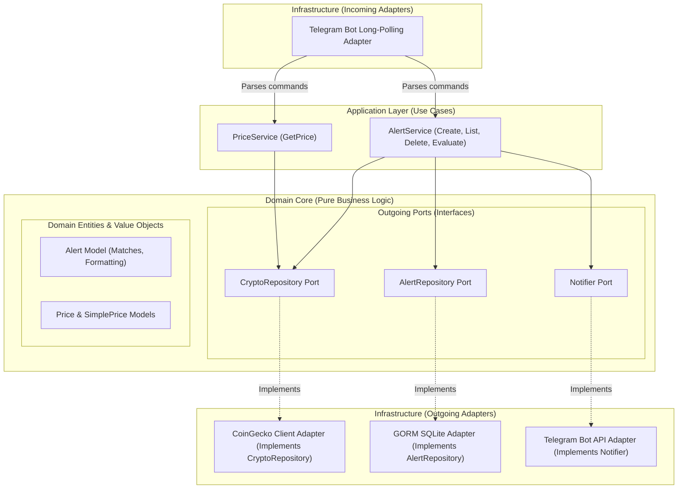
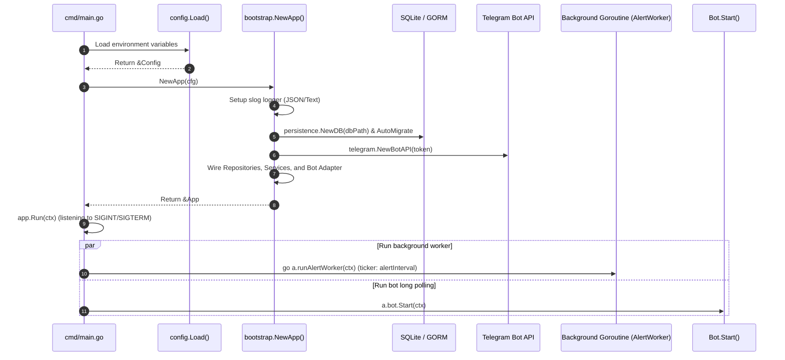
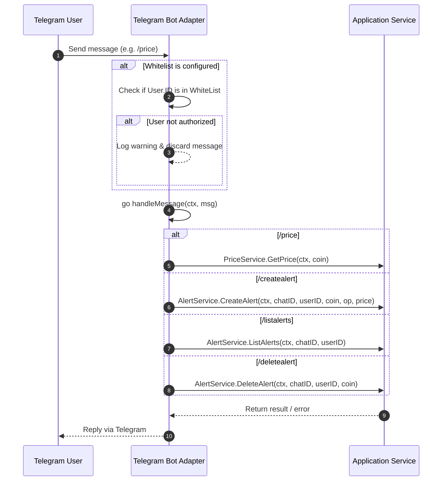
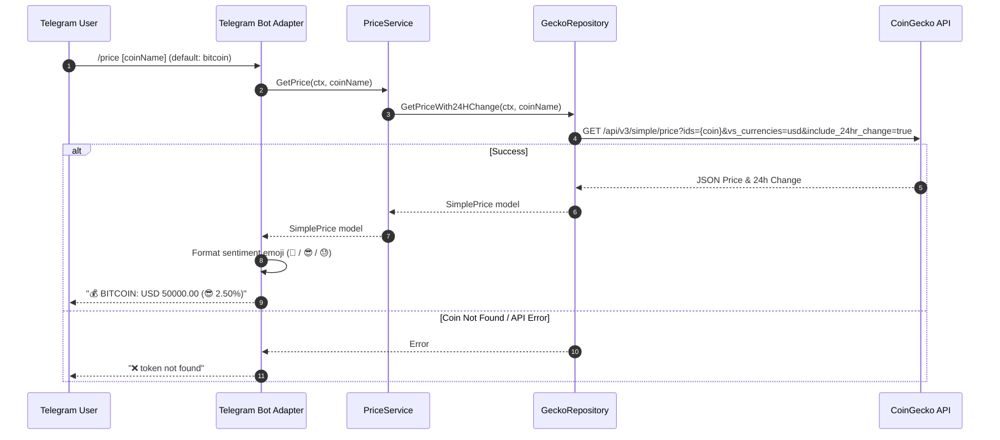
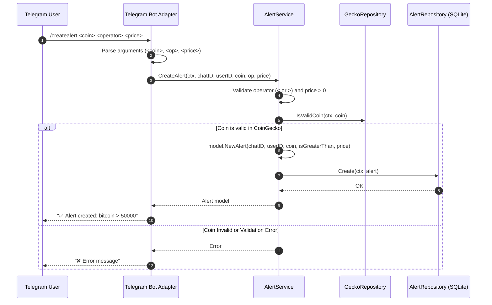
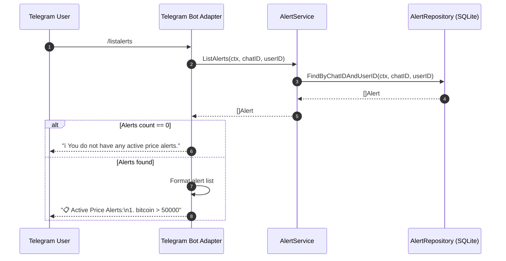
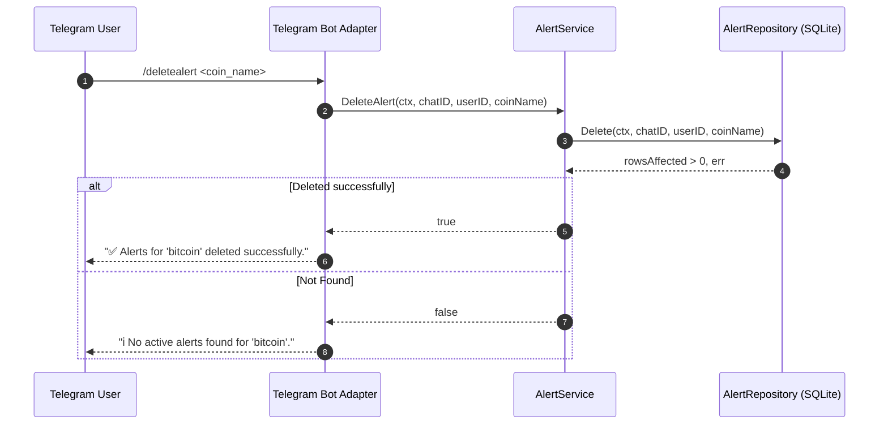
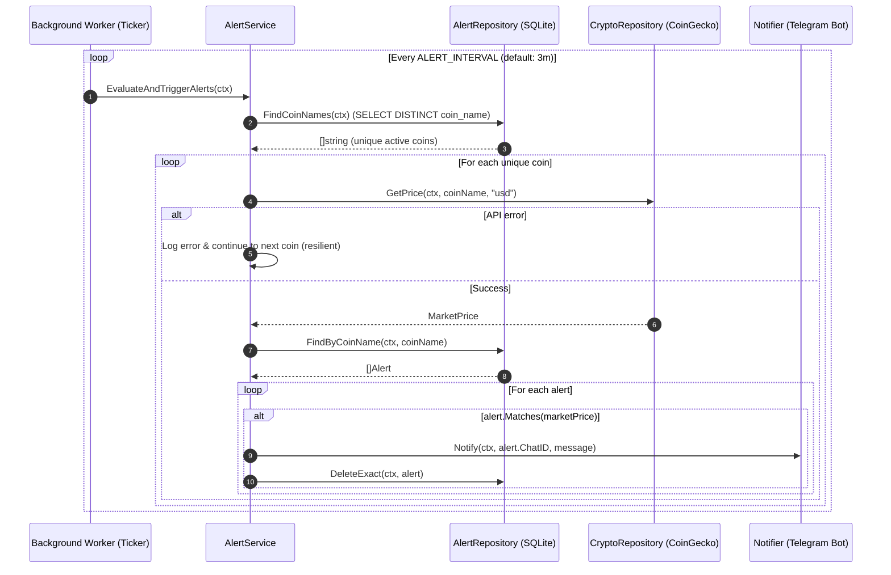

# Crypto Record Bot 🤖📈

A modern Go-based Telegram bot designed to monitor cryptocurrency prices and set automated price threshold alerts using the CoinGecko API and SQLite storage, built following clean Hexagonal Architecture and Domain-Driven Design principles.

---

## 📑 Table of Contents

- [Overview](#-overview)
- [Architecture & Design Patterns](#-architecture--design-patterns)
  - [Architectural Overview](#architectural-overview)
  - [Project Layout](#project-layout)
  - [Layer Responsibilities](#layer-responsibilities)
- [Third-Party Libraries & Dependencies](#-third-party-libraries--dependencies)
- [Detailed System Flows](#-detailed-system-flows)
  - [1. Application Bootstrapping & Lifecycle](#1-application-bootstrapping--lifecycle)
  - [2. Telegram Update & Whitelist Dispatch Flow](#2-telegram-update--whitelist-dispatch-flow)
  - [3. Price Query Flow (`/price`)](#3-price-query-flow-price)
  - [4. Alert Creation Flow (`/createalert`)](#4-alert-creation-flow-createalert)
  - [5. Alert Listing Flow (`/listalerts`)](#5-alert-listing-flow-listalerts)
  - [6. Alert Deletion Flow (`/deletealert`)](#6-alert-deletion-flow-deletealert)
  - [7. Background Alert Monitor & Trigger Flow](#7-background-alert-monitor--trigger-flow)
- [Database Schema](#-database-schema)
- [Configuration & Environment Variables](#-configuration--environment-variables)
- [Installation & Getting Started](#-installation--getting-started)
- [Bot Commands Reference](#-bot-commands-reference)
- [Key Improvements & Technical Notes](#-key-improvements--technical-notes)

---

## 🔍 Overview

**Crypto Record Bot** connects to Telegram via long-polling to provide users with cryptocurrency market data. It allows users to:
- Check real-time cryptocurrency prices with 24-hour percentage changes and contextual reaction emojis (🚀, 😎, 😓).
- Set customizable threshold alerts (trigger when price is greater `>` or lower `<` than a specified target).
- Receive automated Telegram push notifications in background cycles when price conditions are satisfied.
- List and delete active price alerts.
- Restrict bot access using an optional user whitelist.

---

## 🏛 Architecture & Design Patterns

The project follows **Hexagonal Architecture (Ports and Adapters)** along with principles from **Domain-Driven Design (DDD)**, structured logging (`slog`), and graceful shutdown handling.



### Project Layout

```text
CryptoRecordBot/
├── cmd/
│   └── main.go                                  # Main application entry point & signal handling
├── internal/
│   ├── config/
│   │   └── config.go                            # Centralized environment configuration loader
│   ├── bootstrap/
│   │   └── app.go                               # Application lifecycle & dependency wiring
│   ├── domain/
│   │   ├── model/
│   │   │   ├── alert.go                         # Alert domain entity & business evaluation
│   │   │   └── price.go                         # Price value objects & sentiment symbols
│   │   └── ports/
│   │       ├── notifier.go                      # Outgoing user notification port (transport-agnostic)
│   │       └── repositories.go                  # Outgoing CryptoRepository & AlertRepository ports
│   ├── application/
│   │   ├── price_service.go                     # Price query application use case
│   │   └── alert_service.go                     # Alert management & background evaluation use cases
│   └── infrastructure/
│       ├── telegram/
│       │   └── bot.go                           # Telegram long-polling adapter & Notifier implementation
│       ├── client/
│       │   └── crypto_repository.go             # CoinGecko REST client adapter
│       └── persistence/
│           ├── database.go                      # GORM SQLite connection & schema auto-migration
│           ├── entities.go                      # AlertDAO database entity & domain mappers
│           └── repositories.go                  # GORM AlertRepository implementation
├── go.mod
├── go.sum
└── README.md
```

### Layer Responsibilities

1. **Domain Layer ([`internal/domain/`](file:///C:/Users/emipo/go/crypto-record-bot/internal/domain)):**
   - **Models**: Defines pure business entities ([`Alert`](file:///C:/Users/emipo/go/crypto-record-bot/internal/domain/model/alert.go#L10), [`PriceWithChange`](file:///C:/Users/emipo/go/crypto-record-bot/internal/domain/model/price.go#L4), [`SimplePrice`](file:///C:/Users/emipo/go/crypto-record-bot/internal/domain/model/price.go#L23)) with zero external dependencies.
   - **Ports**: Interface contracts ([`Notifier`](file:///C:/Users/emipo/go/crypto-record-bot/internal/domain/ports/notifier.go#L6), [`CryptoRepository`](file:///C:/Users/emipo/go/crypto-record-bot/internal/domain/ports/repositories.go#L9), [`AlertRepository`](file:///C:/Users/emipo/go/crypto-record-bot/internal/domain/ports/repositories.go#L16)) specifying capabilities required by the domain.

2. **Application Layer ([`internal/application/`](file:///C:/Users/emipo/go/crypto-record-bot/internal/application)):**
   - Contains use case services: [`PriceService`](file:///C:/Users/emipo/go/crypto-record-bot/internal/application/price_service.go#L12) and [`AlertService`](file:///C:/Users/emipo/go/crypto-record-bot/internal/application/alert_service.go#L16). Orchestrates domain logic, calls repository ports, and triggers user notifications.

3. **Infrastructure Layer ([`internal/infrastructure/`](file:///C:/Users/emipo/go/crypto-record-bot/internal/infrastructure)):**
   - **Telegram Adapter ([`Bot`](file:///C:/Users/emipo/go/crypto-record-bot/internal/infrastructure/telegram/bot.go#L18))**: Listens for updates using long-polling, handles whitelist authorization, parses chat commands, calls application services, and implements [`ports.Notifier`](file:///C:/Users/emipo/go/crypto-record-bot/internal/domain/ports/notifier.go#L6).
   - **Crypto Client ([`GeckoRepository`](file:///C:/Users/emipo/go/crypto-record-bot/internal/infrastructure/client/crypto_repository.go#L15))**: Implements [`CryptoRepository`](file:///C:/Users/emipo/go/crypto-record-bot/internal/domain/ports/repositories.go#L9) interacting with CoinGecko REST endpoints.
   - **Persistence ([`AlertRepository`](file:///C:/Users/emipo/go/crypto-record-bot/internal/infrastructure/persistence/repositories.go#L13))**: Implements [`AlertRepository`](file:///C:/Users/emipo/go/crypto-record-bot/internal/domain/ports/repositories.go#L16) using GORM and SQLite.

4. **Bootstrap & Configuration ([`internal/bootstrap/`](file:///C:/Users/emipo/go/crypto-record-bot/internal/bootstrap), [`internal/config/`](file:///C:/Users/emipo/go/crypto-record-bot/internal/config)):**
   - Centralizes environment variable parsing and validation. Initializes database connections, repositories, application use cases, and starts the background worker loop with graceful cancellation.

---

## 📦 Third-Party Libraries & Dependencies

| Library | Version | Purpose | Usage in Project |
| :--- | :--- | :--- | :--- |
| [`github.com/go-telegram-bot-api/telegram-bot-api/v5`](https://github.com/go-telegram-bot-api/telegram-bot-api) | `v5.5.1` | Telegram Bot API client | Long-polling updates stream, sending response messages, chat and user ID extraction. |
| [`github.com/superoo7/go-gecko/v3`](https://github.com/superoo7/go-gecko) | `v1.0.0` / `v3` | CoinGecko API client | Fetching token listings, simple single prices, and 24h market price changes. |
| [`gorm.io/gorm`](https://gorm.io/) | `v1.31.2` | Golang ORM | Object-relational mapping, database migrations, CRUD query building. |
| [`gorm.io/driver/sqlite`](https://github.com/go-gorm/sqlite) | `v1.6.0` | SQLite driver for GORM | Embedded SQL database engine support (`crypto_record.db`). |
| [`github.com/mattn/go-sqlite3`](https://github.com/mattn/go-sqlite3) | `v1.14.50` | CGO SQLite3 driver | Low-level SQLite C bindings for Go. |

---

## 🔄 Detailed System Flows

### 1. Application Bootstrapping & Lifecycle



1. [`main.go`](file:///C:/Users/emipo/go/crypto-record-bot/cmd/main.go#L19) sets up signal handling with `signal.NotifyContext(context.Background(), os.Interrupt, syscall.SIGTERM)` and loads [`config.Load()`](file:///C:/Users/emipo/go/crypto-record-bot/internal/config/config.go#L20).
2. [`bootstrap.NewApp(cfg)`](file:///C:/Users/emipo/go/crypto-record-bot/internal/bootstrap/app.go#L28) configures structured logging (`log/slog`).
3. Connects to SQLite database `crypto_record.db` and runs `AutoMigrate` for [`AlertDAO`](file:///C:/Users/emipo/go/crypto-record-bot/internal/infrastructure/persistence/entities.go#L8).
4. Creates CoinGecko HTTP client and wires domain repositories and application services ([`PriceService`](file:///C:/Users/emipo/go/crypto-record-bot/internal/application/price_service.go#L12), [`AlertService`](file:///C:/Users/emipo/go/crypto-record-bot/internal/application/alert_service.go#L16)).
5. Instantiates the Telegram bot adapter implementing [`ports.Notifier`](file:///C:/Users/emipo/go/crypto-record-bot/internal/domain/ports/notifier.go#L6).
6. [`app.Run(ctx)`](file:///C:/Users/emipo/go/crypto-record-bot/internal/bootstrap/app.go#L67) launches the background alert worker and starts Telegram long-polling until a shutdown signal is received.

---

### 2. Telegram Update & Whitelist Dispatch Flow



1. An update is received over the long-polling channel.
2. **Whitelist Evaluation**:
   - **If `WHITE_LIST` is configured**: The bot verifies if `update.Message.From.ID` is present in the allowed list. If unauthorized, access is denied, logged on the server, and the message is discarded.
   - **If `WHITE_LIST` is empty or unset**: Whitelist filtering is bypassed (`len(bot.whiteList) == 0`). The bot operates in **public mode**, allowing any Telegram user to interact and execute commands.
3. If authorized (or running in public mode), the message is dispatched concurrently with a timeout context (`go b.handleMessage(ctx, msg)`).

---

### 3. Price Query Flow (`/price`)



- **Command Syntax**: `/price` or `/price <coin_id>` (e.g., `/price ethereum`).
- **Default Coin**: Defaults to `"bitcoin"` if no argument is supplied.
- **Emoji Calculation**:
  - `change >= 15%` ➔ 🚀
  - `change > 0%` ➔ 😎
  - `change < 0%` ➔ 😓
  - `change == 0%` ➔ *(empty)*

---

### 4. Alert Creation Flow (`/createalert`)



- **Command Syntax**: `/createalert <coin_name> <comparison_operator> <target_price>`
- **Validation Steps**:
  1. Ensures exactly 3 arguments are provided.
  2. Ensures comparison symbol is `<` or `>`.
  3. Ensures price is a positive decimal number.
  4. Validates `coinName` against CoinGecko's master coin list (`IsValidCoin`).
- **Storage**: Persisted into SQLite via GORM.

---

### 5. Alert Listing Flow (`/listalerts`)



- **Command Syntax**: `/listalerts`
- Filters records matching the active `ChatID` and `UserID`.
- Formats each alert into a readable numbered list.

---

### 6. Alert Deletion Flow (`/deletealert`)



- **Command Syntax**: `/deletealert <coin_name>` (e.g., `/deletealert bitcoin`).
- Deletes active alerts for the given coin and user.

---

### 7. Background Alert Monitor & Trigger Flow



1. **Cycle Interval**: Executes periodically based on `ALERT_INTERVAL` (default: 3 minutes).
2. **Distinct Coins Query**: Calls `FindCoinNames()` to retrieve unique coin names with active alerts, minimizing CoinGecko API calls.
3. **Resilient Price Query**: Fetches the current USD market price. If one coin fails, it logs the error and continues to the next without breaking the loop.
4. **Condition Evaluation**: Evaluates `alert.Matches(marketPrice)` for each stored alert.
5. **Notification & Cleanup**: Sends a notification to the user via [`ports.Notifier`](file:///C:/Users/emipo/go/crypto-record-bot/internal/domain/ports/notifier.go#L6) and removes the triggered alert from the database.

---

## 🗄 Database Schema

The bot utilizes SQLite with GORM auto-migrations. Table name: `alerts`.

| Column | Type | GORM Constraints | Description |
| :--- | :--- | :--- | :--- |
| `chat_id` | `INTEGER` / `BIGINT` | `primaryKey;autoIncrement:false` | Telegram chat identifier |
| `user_id` | `INTEGER` / `BIGINT` | `primaryKey;autoIncrement:false` | Telegram user identifier |
| `coin_name` | `TEXT` | `primaryKey` | Cryptocurrency ID (lowercase, e.g. `bitcoin`) |
| `is_greater_than` | `BOOLEAN` | `primaryKey` | `1` for `>`, `0` for `<` |
| `price` | `REAL` / `FLOAT` | - | Target threshold price |
| `created_at` | `DATETIME` | - | Creation timestamp |

---

## ⚙️ Configuration & Environment Variables

| Variable | Type | Required | Default | Description | Example |
| :--- | :--- | :--- | :--- | :--- | :--- |
| `TELEGRAM_TOKEN` | `string` | **Yes** | - | Telegram Bot API token obtained from [@BotFather](https://t.me/botfather). | `123456789:ABCdefGHIjklMNOpqrsTUVwxyz` |
| `WHITE_LIST` | `string` | No | *(empty)* | Comma-separated list of numeric Telegram User IDs authorized to interact with the bot. | `123456789,987654321` |
| `PROFILE` | `string` | No | `prod` | Logging format and level (`dev` for text debug logs, `prod` for JSON logs). | `dev` or `prod` |
| `DB_PATH` | `string` | No | `crypto_record.db` | Path to the SQLite database file. | `crypto_record.db` |
| `ALERT_INTERVAL` | `string` | No | `3m` | Interval between background alert evaluation cycles (parsed via `time.ParseDuration`). | `1m`, `3m`, `5m` |

> ℹ️ **Note on `WHITE_LIST` behavior:**
> - **Empty or Unset (Default)**: The bot runs in **public mode**. Any Telegram user or group chat can issue commands and manage alerts.
> - **Populated with IDs**: The bot runs in **restricted mode**. Only users whose numeric Telegram User IDs are listed in `WHITE_LIST` will be allowed to execute commands. Messages from unauthorized users are ignored and logged.

---

## 🚀 Installation & Getting Started

### Prerequisites
- [Go 1.25+](https://golang.org/dl/)
- GCC / CGO compiler (required by `mattn/go-sqlite3`)
- A Telegram Bot Token from [@BotFather](https://t.me/botfather)

### Running Locally

1. **Clone the repository**:
   ```bash
   git clone https://github.com/wyveriano/crypto-record-bot.git
   cd crypto-record-bot
   ```

2. **Install dependencies**:
   ```bash
   go mod download
   ```

3. **Set environment variables**:
   - **Linux / macOS**:
     ```bash
     export TELEGRAM_TOKEN="your_telegram_bot_token"
     export WHITE_LIST="123456789"
     export PROFILE="dev"
     ```
   - **Windows (PowerShell)**:
     ```powershell
     $env:TELEGRAM_TOKEN="your_telegram_bot_token"
     $env:WHITE_LIST="123456789"
     $env:PROFILE="dev"
     ```

4. **Run the application**:
   ```bash
   go run cmd/main.go
   ```

---

## 💬 Bot Commands Reference

| Command | Arguments | Description | Example |
| :--- | :--- | :--- | :--- |
| `/price` | `[coin_id]` *(optional)* | Fetches current USD price and 24h change for the specified coin (defaults to Bitcoin). | `/price`<br>`/price ethereum` |
| `/createalert` | `<coin_id> <operator> <price>` | Registers a new price alert. Operator can be `<` or `>`. | `/createalert bitcoin > 50000`<br>`/createalert cardano < 0.40` |
| `/listalerts` | *None* | Lists all active price alerts for the current user and chat. | `/listalerts` |
| `/deletealert` | `<coin_id>` | Deletes active alerts for the given coin. | `/deletealert bitcoin` |

---

## 💡 Key Improvements & Technical Notes

- **Pure Hexagonal Architecture**: The domain layer has zero imports of third-party libraries (`telegram-bot-api`, `go-gecko`, `gorm`). All external interactions are mediated through pure domain ports ([`Notifier`](file:///C:/Users/emipo/go/crypto-record-bot/internal/domain/ports/notifier.go#L6), [`CryptoRepository`](file:///C:/Users/emipo/go/crypto-record-bot/internal/domain/ports/repositories.go#L9), [`AlertRepository`](file:///C:/Users/emipo/go/crypto-record-bot/internal/domain/ports/repositories.go#L16)).
- **Graceful Lifecycle & Shutdown**: Full `context.Context` propagation across all layers. Interrupt signals (`SIGINT`, `SIGTERM`) safely stop the background ticker and Telegram update listener without data corruption.
- **Structured Logging (`slog`)**: Replaced standard `log.Print` with standard Go `log/slog` structured logging (JSON in production, text in dev).
- **Error Cascading Fix**: The background alert evaluation loop uses `continue` instead of `return` on coin query failure, ensuring individual API hiccups do not halt monitoring for other tokens.
- **Centralized Configuration**: All environment variables are parsed and validated at startup in [`internal/config/config.go`](file:///C:/Users/emipo/go/crypto-record-bot/internal/config/config.go).